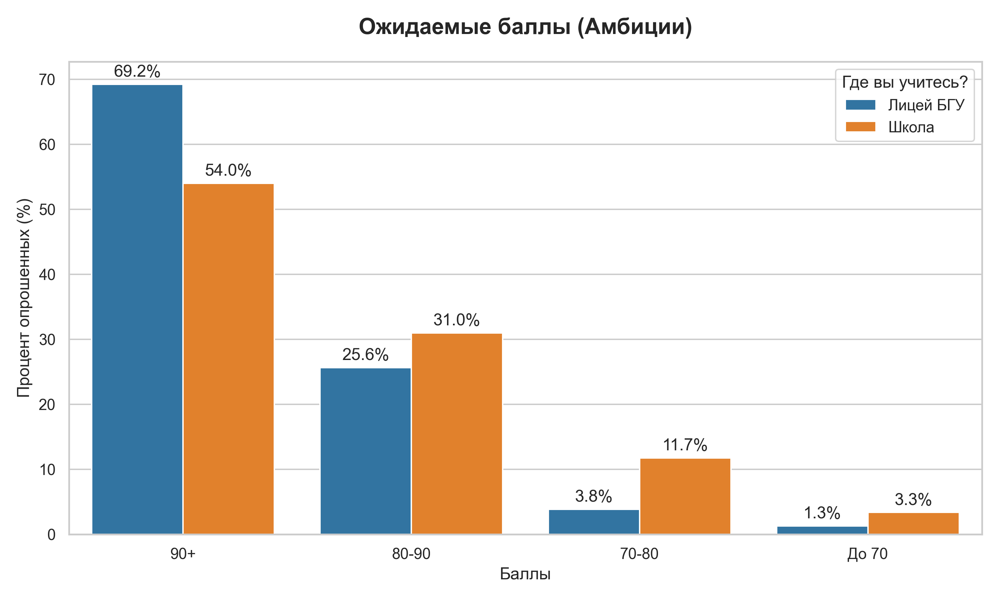
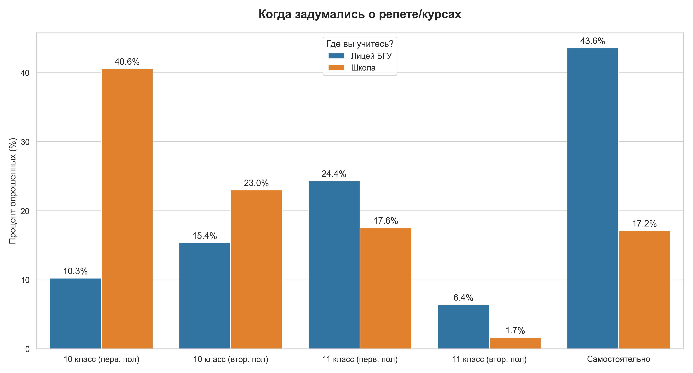
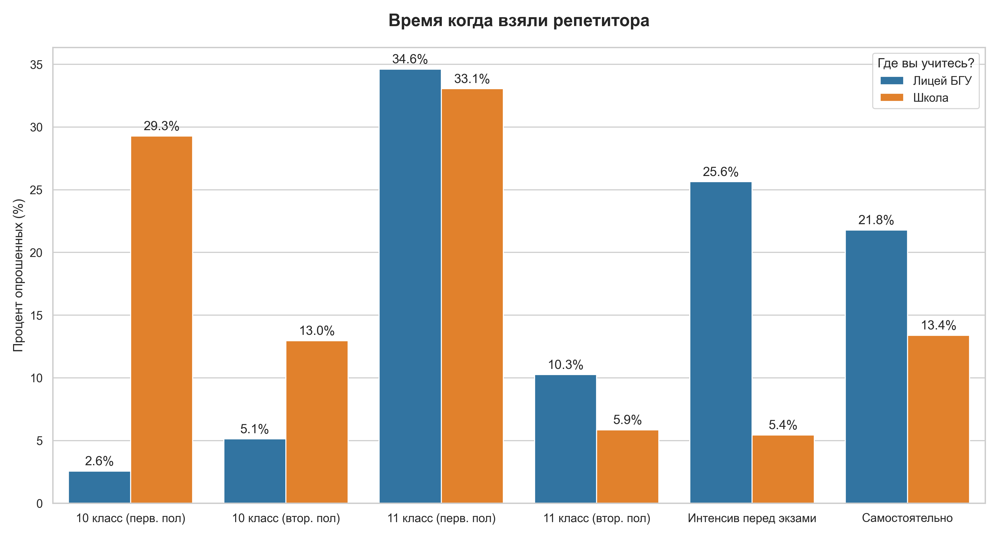
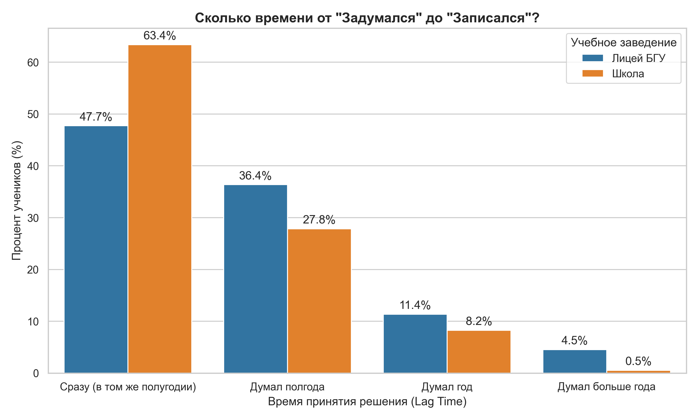
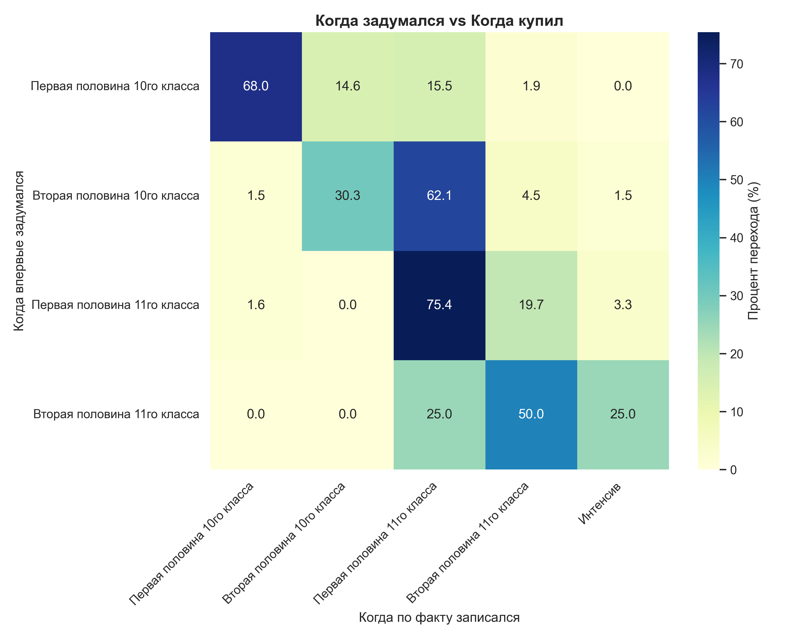
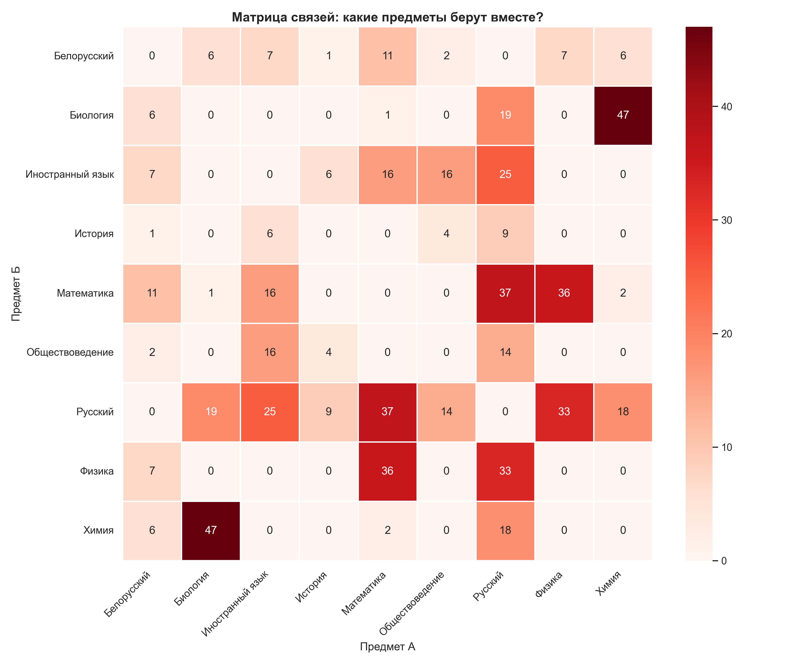

# Data-Driven подход в EdTech: Когда школьники реально покупают курсы?
### Анализ поведения абитуриентов (Лицей БГУ vs Школы)

> **Автор:** Ушаров Дмитрий Павлович  
> **Статус:** Выпускник Лицея БГУ 2025 | Студент ФПМИ БГУ, специальность «Информатика» (Яндекс-группа)

---

## 1. Введение
В какой-то момент я задался вопросом: **когда на самом деле люди начинают готовиться к экзаменам?**

Чтобы ответить на него не интуитивно, а на основе данных, я провел количественное исследование. Была разработана анкета с ключевыми метриками:
*   Учебное заведение и профиль.
*   Ожидаемые баллы (Амбиции).
*   Временной лаг: когда впервые задумались о подготовке vs когда реально записались.
*   Выбор предметов и репетиторов.

## 2. Методология и Сбор данных
Для получения репрезентативной картины использовался гибридный метод сбора данных (**N = 317**):

1.  **Ретроспективный опрос:** Опрос первокурсников БГУ (через потоковые чаты факультетов), которые уже прошли путь поступления и могут восстановить хронологию.
2.  **Текущий срез:** Опрос нынешних 11-классников.

### Технический нюанс (Data Cleaning)
При обработке данных возникла проблема нормализации ответов в полях со свободным вводом. Например, на вопрос *"Где вы учитесь?"* респонденты отвечали по-разному: *"ЛБГУ", "Лицей", "ліцэй бду", "лбду"* и т.д.

Был написан скрипт на **Python** для парсинга и кластеризации этих ответов. Это позволило четко разделить аудиторию на два целевых сегмента:
*   **Сегмент 1:** "Лицей БГУ".
*   **Сегмент 2:** "Школа" (включая гимназии).

## 3. Причина разделения на сегменты
Первое фундаментальное различие — **уровень уверенности**.
Лицеисты БГУ, имея льготы при поступлении и находясь в сильной академической среде, гораздо чаще рассчитывают на свои силы. Школьники же чаще ищут внешнюю опору и подстраховку.

## 4. Поведенческие паттерны

*   **Школьники:** Более тревожны. Значительная часть начинает искать репетитора уже в первой половине 10 класса. Они покупают "спокойствие" на 1.5–2 года вперед.
*   **Лицеисты:** Демонстрируют "отложенный спрос". Они могут вообще не брать репетиторов в 10 классе, полагаясь на самостоятельную подготовку.
На картинках видно когда школьники и лицеисты начинают думать о репетиторе

И когда реально берут его

## 5. Lag Time
Один из ключевых бизнес-инсайтов исследования — время между возникновением потребности (*"надо бы найти курсы"*) и реальной записью.

Данные показывают огромную инертность спроса:
*   **47.7%** лицеистов и **63.4%** школьников покупают сразу (в том же полугодии).
*   Остальные находятся в стадии принятия решения **от полугода до года**.

Это значит, что маркетинговая воронка должна быть длинной. Клиент, увидевший рекламу в сентябре 10-го класса, может "созреть" для покупки только к сентябрю 11-го.

На тепловой карте четко виден этот переход: кластер тех, кто задумался в 10-м классе, но совершил целевое действие только в 11-м.

Нельзя не упомянуть, что самая нижняя строка (те кто задумались только в второй половине 11го класса) - скорее погрешность. Таких человек всего было 8 штук. Так же какое то кол-во людей мискликало поэтому на карте видно как будто кто-то сначала взял репетитора и только потом подумал об этом.

## 6. Интенсивы
Изначальная гипотеза заключалась в том, что во второй половине 11 класса будет глобальный всплеск записей на курсы. Реальность оказалась сложнее.

1.  **Школьники идут на интенсивы неохотно.** Большая часть массового сегмента уже имеет репетитора или записана в онлайн-школу к моменту старта экспресс-курсов.
2.  **Интенсив — продукт для "умных" (или самоуверенных).** Лицеисты, которые до последнего верили в самоподготовку, весной перед экзаменами начинают искать способы систематизировать знания. Именно они составляют костяк аудитории краткосрочных курсов.

**Вывод:** Интенсивы бесполезно таргетировать на слабых учеников. Это продукт для отличников, которым нужно "шлифануть" знания перед ЦЭ.

## 7. Продуктовая матрица: Что с чем покупают?
Анализ корреляций предметов показал готовые связки для кросс-продаж.

*   **Биология + Химия:** Самый монолитный кластер. Если ученик берет Биологию, он почти гарантированно ищет Химию (**47 совпадений** — самая сильная связь в датасете).
*   **Математика + Физика:** Классическая техническая связка.
*   **Русский язык:** Универсальный "доп", который берут в довесок к любому профилю.

*(Ярко-красный квадрат на пересечении Биологии и Химии показывает идеальную нишу для пакетных предложений).*

## 8. Итог: Стратегия продаж
На основе данных вырисовывается оптимальная стратегия:

| Период | Аудитория | Продукт |
| :--- | :--- | :--- |
| **К началу 10-го класса** | Школьники и родители | Продаем "Фундамент" и снятие тревожности на 2 года. |
| **К началу 11-го класса** | Массовый сегмент | Работа с базой "думающих". Последний шанс продать годовой курс. |
| **Март-Апрель 11-го класса** | Лицей БГУ, Гимназии | Агрессивный маркетинг "Интенсивов". Работа с теми, кто верил в самоподготовку. |

---

### Техническая часть
Исследование проведено с использованием **Python** (`Pandas`, `Seaborn`, `Matplotlib`).
Полный код анализа, очистки данных и построения графиков доступен в репозитории.

### Благодарности
Хочу отдельно поблагодарить выпускника Лицея БГУ **Антона Повалишева** за помощь в обработке датасета (ручной парсинг колонки *"По каким предметам взяли репетитора?"*). Без его участия этап очистки данных занял бы гораздо больше времени.
